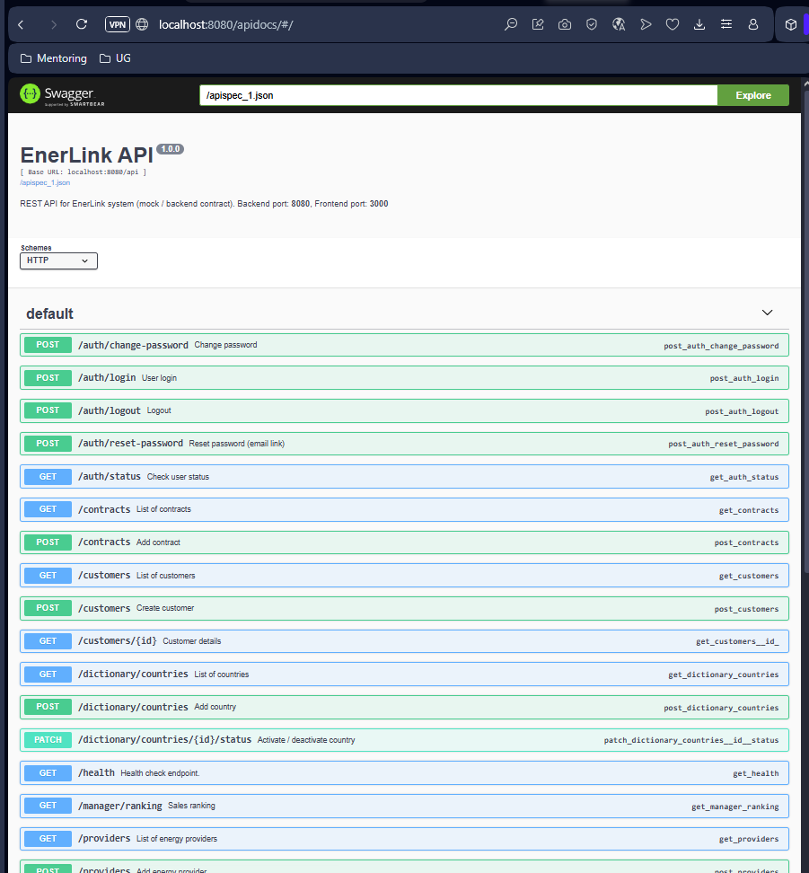

# EnerLink
> Customer Relationship Management System for Energy Vendor (CRM)

## Project description

The goal of the CRM system is to improve sales, marketing, and customer service processes by collecting, analyzing, and using customer data. The system includes a database of customers, contracts, and energy sales representatives divided into teams managed by managers. It also enables monitoring of customer interactions and ongoing sales performance.

> Live demo [_here_](https://www.enerlink.com).

## Table of Contents
* [Functional Requierements](#Functional Requierements)
* [General Info](#general-information)
* [Technologies Used](#technologies-used)
* [Features](#features)
* [Screenshots](#screenshots)
* [Setup](#setup)
* [Usage](#usage)
* [Project Status](#project-status)
* [Room for Improvement](#room-for-improvement)
* [Acknowledgements](#acknowledgements)
* [Contact](#contact)
* [License](#license)

## General Information
EnerLink is a CRM platform for energy vendors, designed to streamline customer management, contract tracking, and sales analysis.  
The system supports multiple user roles — **administrators, managers, and sales representatives** — providing tailored dashboards and access permissions.

## Setup project
[View Setup project](./documentation/setup_project.md)

## Functional Requierements
Detailed functional requirements are described in the following document:  
[View Functional Requirements](./documentation/functional_requirements.md)

## Database
Database is described in the following document:  
[View Database description](./documentation/database_info.md)


## Technologies Used

### **Frontend**
- React `^19.2.0`
- TypeScript `^4.9.5`
- React Scripts `5.0.1`
- React Testing Library
- Jest
- Web Vitals

### **Backend**
- Flask `3.1.2`
- Flask-SQLAlchemy `3.0.5`
- psycopg2-binary `2.9.9`
- SQLAlchemy `2.0.44`
- Werkzeug `3.1.3`
- Jinja2 `3.1.6`
- pytest `8.4.0`
- Swagger for API documentation

### **Database**
- PostgreSQL


## Features
- Role-based user management (Admin / Manager / Sales Representative)
- Customer and contract management
- Energy provider and tariff database
- Analytics dashboards and team performance ranking
- Tag and label system for categorization
- Secure authentication with password policies
- Swagger-based REST API documentation


## Screenshots


## API Documentation (Swagger)

EnerLink uses Swagger UI for live API documentation.

The Swagger YAML file is located at:
backend/oneapi.yaml

Once the Flask server (flask run) is running, open:
```bash
 http://localhost:8080/apidocs/
```



More info abiut api: 
[View Oneapi](./documentation/oneapi.md)
[View Rest Api](./documentation/rest_api.md)

## Project Status
Project is: _in progress_ 

## Room for Improvement

- Add Docker configuration for easier deployment

- Implement unit and integration tests

- Enhance UI with modern dashboard components (charts, analytics)

- Introduce JWT authentication


## Contact
Created by:
- Rafał Arnista
- Mariusz Dudzik
- Marcin Gierszewski
- Paulina Kimak [@rockpiryt](https://www.paulinakimak.pl/)


## License
This project is open source and available under the Apache License 2.0