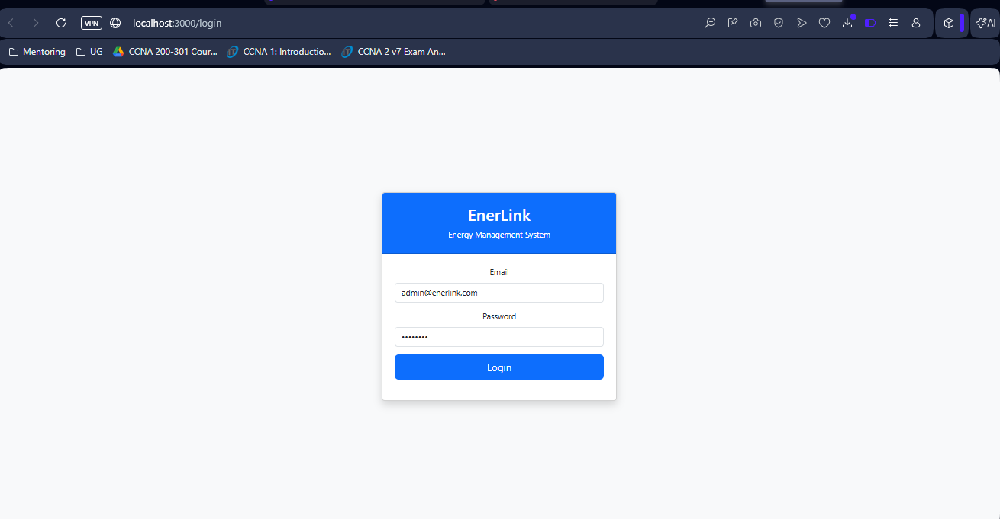
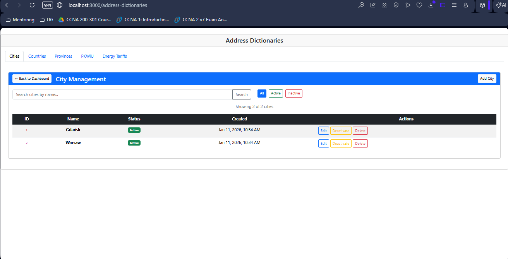

# Screenshots

## Login page

## Main Dashboard

## Admin Panel

### Roles Managment

### System Reports

### System settings

### Users managment

## Navigation
### Users

### Roles

### Customers

### Contracts

### Energy Providers

### Sales Representatives

### Tags

### Analytics Dashboard

### Manager Panel

### Address Dict

### Tariffs
