# Screenshots

## Main Dashboard

## Admin Panel

### Roles Managment

### System Reports

### System settings
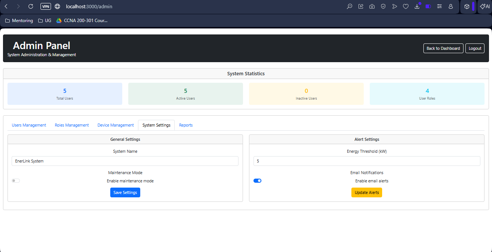

### Users managment
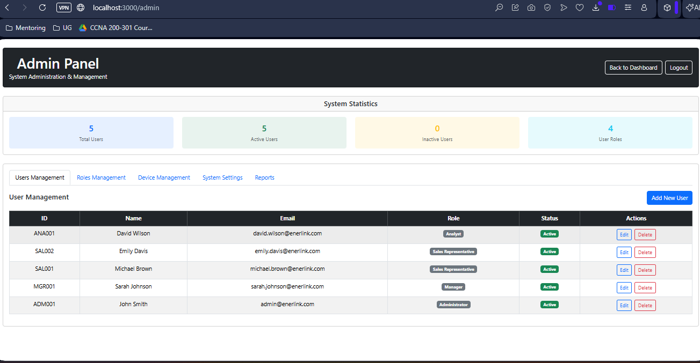

## Navigation
### Users
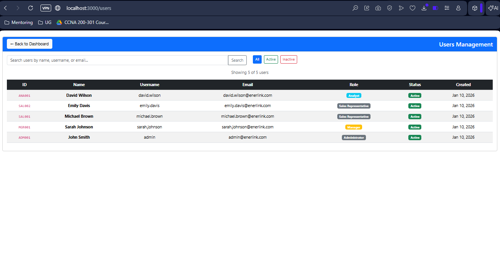

### Roles
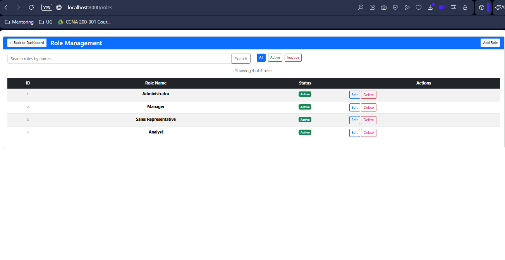

### Customers
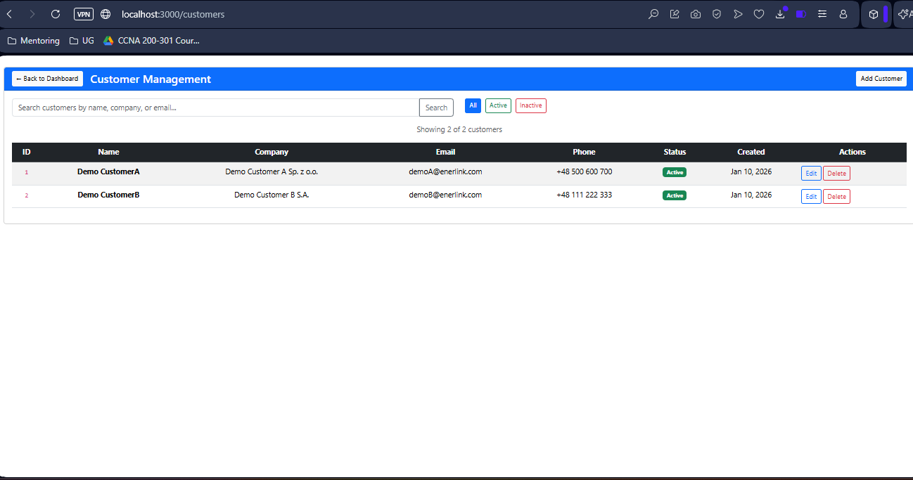

### Contracts
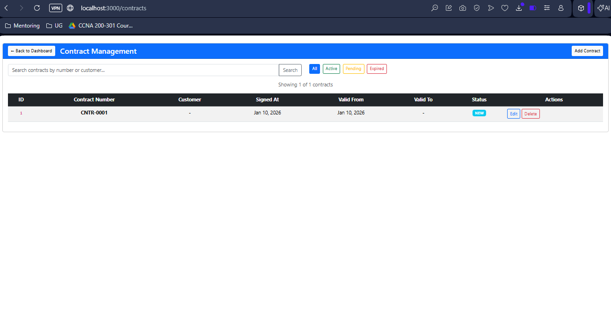

### Energy Providers
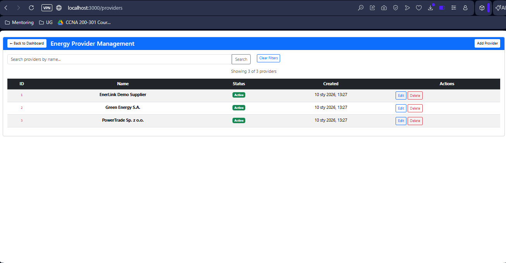

### Sales Representatives
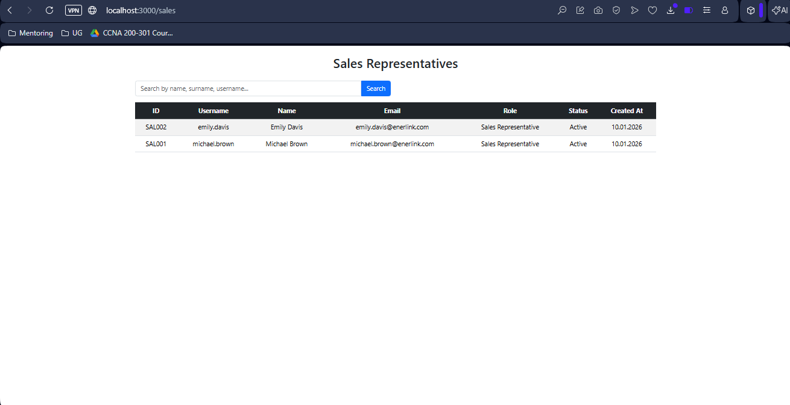

### Tags
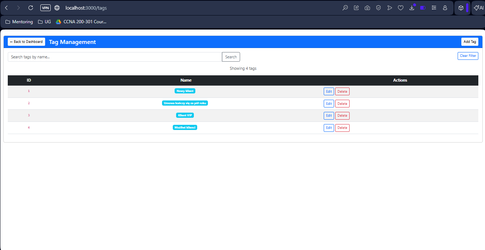

### Analytics Dashboard
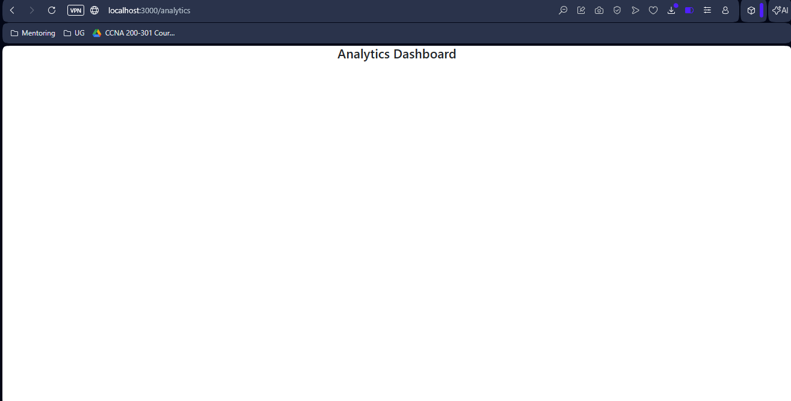

### Manager Panel
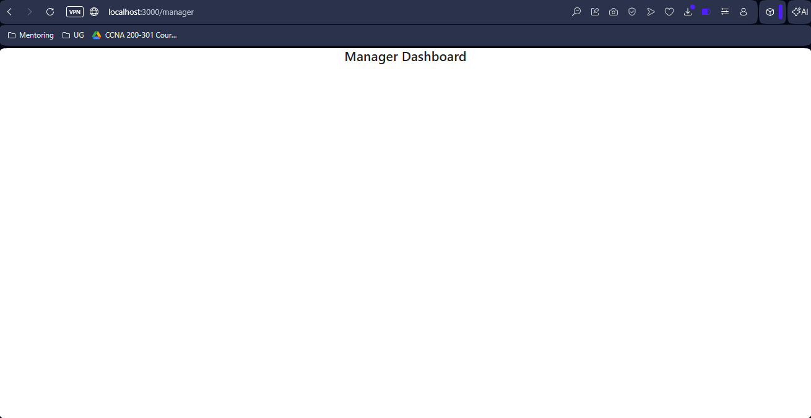

### Countries
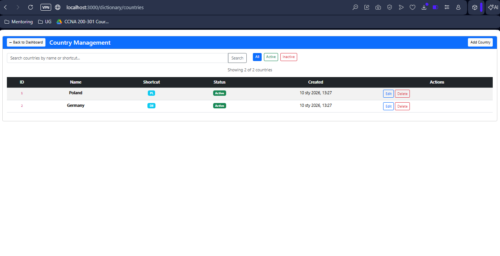

### Cities
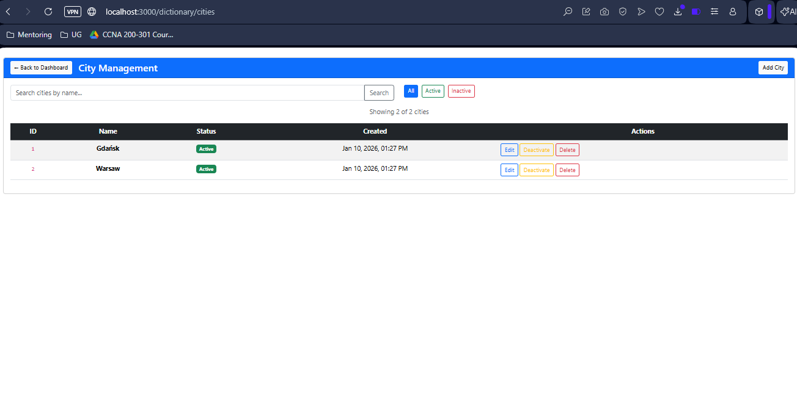

### Districts

### PKWIU List
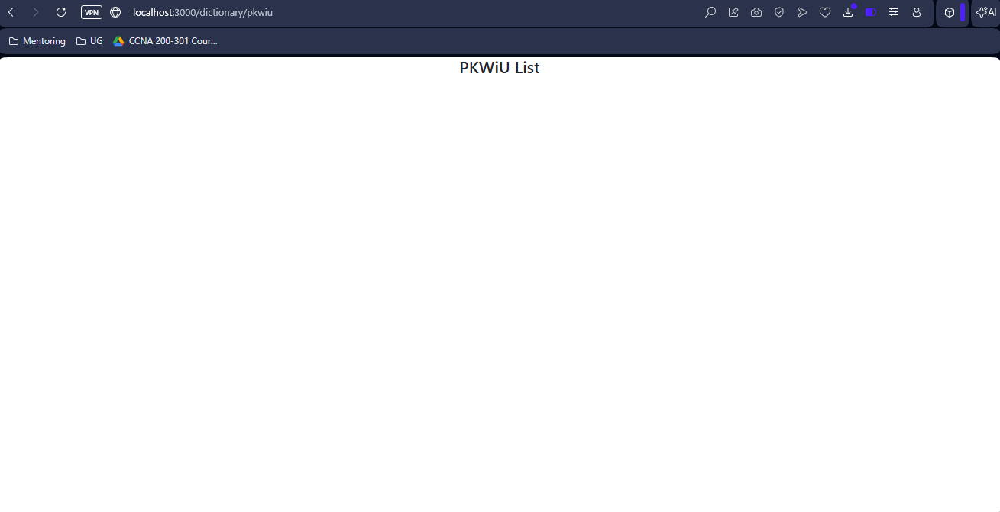

### Tariffs
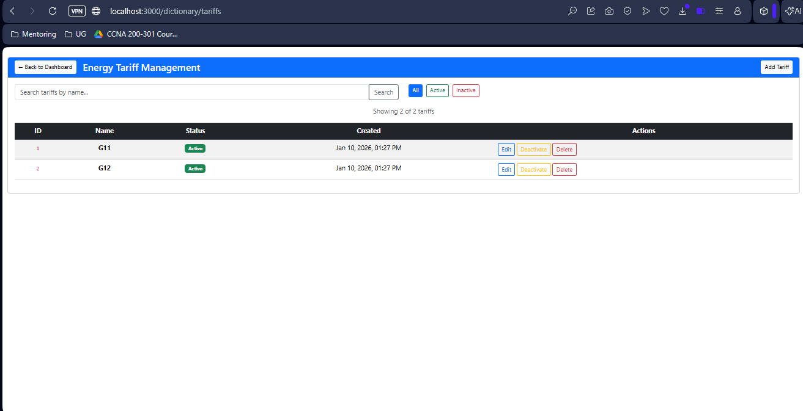

## Swagger documentation
### Part1 
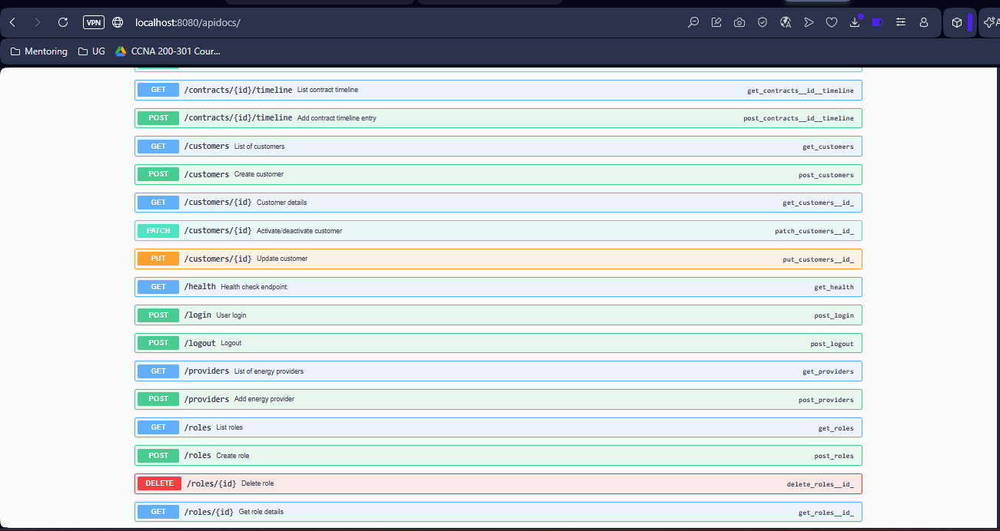

### Part2 
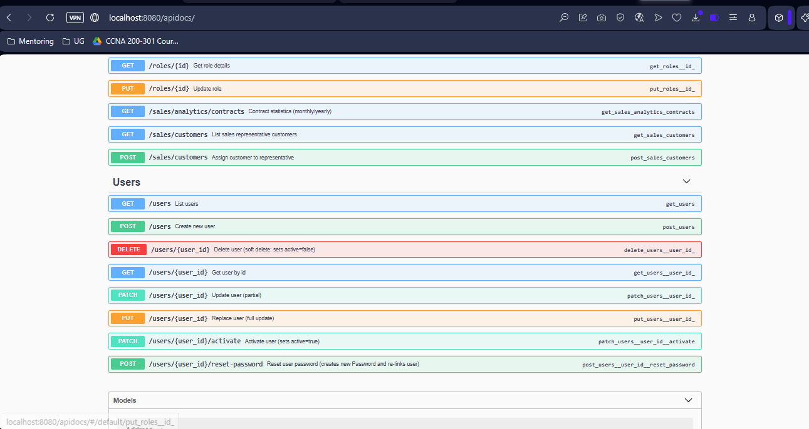

### Part3 
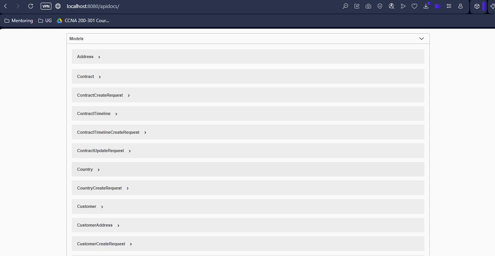

### Part4 
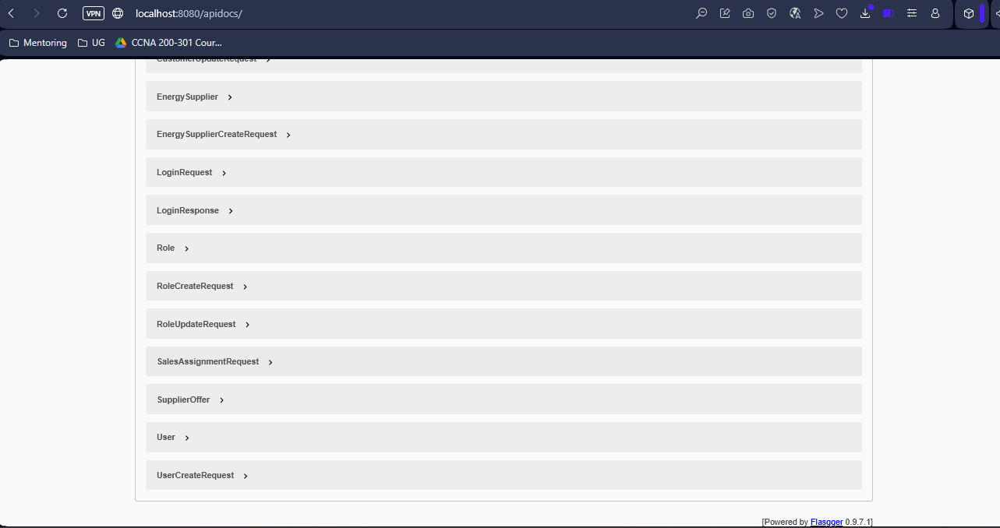
